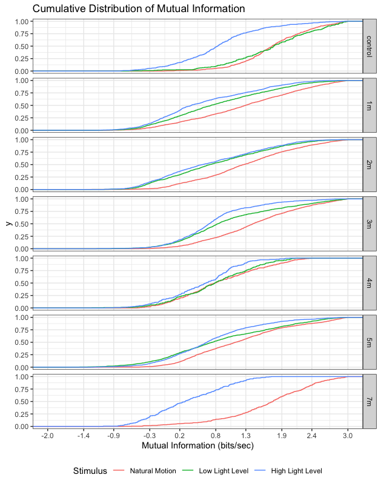

# The Direct Method of Mutual Information

Applying information theory to any biological setting is challenging because Shannon's information theory was created initially to design electrical circuits. Electrical signals in both man-made circuits and the retina are at their most fundamental level signals sent through a channel with some added noise. The retina is an information channel for external stimuli that delivers to the brain that gets added noise. Though the overall schematic of the retina is similar to an electrical circuit, the encoding process of information by the retina is not as simple and is more uncertain. While independent and identically distributed binary signals can be engineered into an electrical circuit and then interpreted with a binomial model, the retina already has a model underlying its action potential firing. Models for the encoding the stimuli is studied heavily in sensory neuroscience, but the true sampling model for action potentials sent by the retina is not known. Thus, neuroscience has created room for having metrics and measures independent of any underlying statistical models that violate assumptions or those that do not fit the distribution of all cells. 

As mutual information depends on entropy, which requires probability estimates for events, there has to be a process for creating a probabilistic distribution for the patterns in spike train recordings (Eq 1). To estimate this distribution without a model, Bialek created the "direct method" to come up with a probability distribution by solely using the recording. The process involves selecting a pattern size (window) that is separated into sections (bins) that indicate the occurrence of action potential or not. That pattern window is shifted across the entire recording to create a pattern distribution that gets used to describe the probability of the recording (N Tishby).

Binning parameters like the bin size and the window size affect the probability distribution significantly, so binning arrangements were examined on contour diagrams. Large bins underestimate information as entire patterns may not be captured well, and bin sizes too small underestimate information rates because it can skew the distribution to patterns with no spiking. Thus, more appropriate binning arrangements will maximize information transmission but also keep window size low so enough data can be sampled (app below creates visualizations). 

<center>
```{r}
knitr::include_app('https://mishek-thapa.shinyapps.io/mutual_app/', height = '600px')
```
</center>

<center>
{width=500px}
<center>

Fig 1: Cumuluative Distribution of Mutual Information do not show significant changes across degeneration states but instead patterns in which the natural motion stimuli initiated more informative responses.

After adjusting the binning specifications for each degeneration state (specifications in table below), information rate estimates do not change (Fig 1). This would imply that the information channel over degeneration is not altered even after blindness. The results also demonstrate that the retina is generally more informative in front of a natural motion movie. That provides some evidence that the retina has evolved to code stimuli better if it contains natural scenes. 


