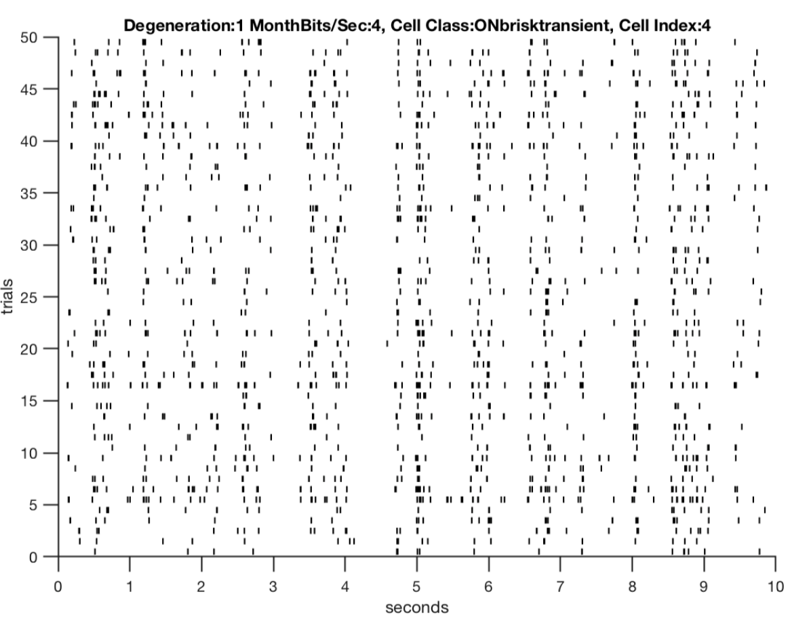
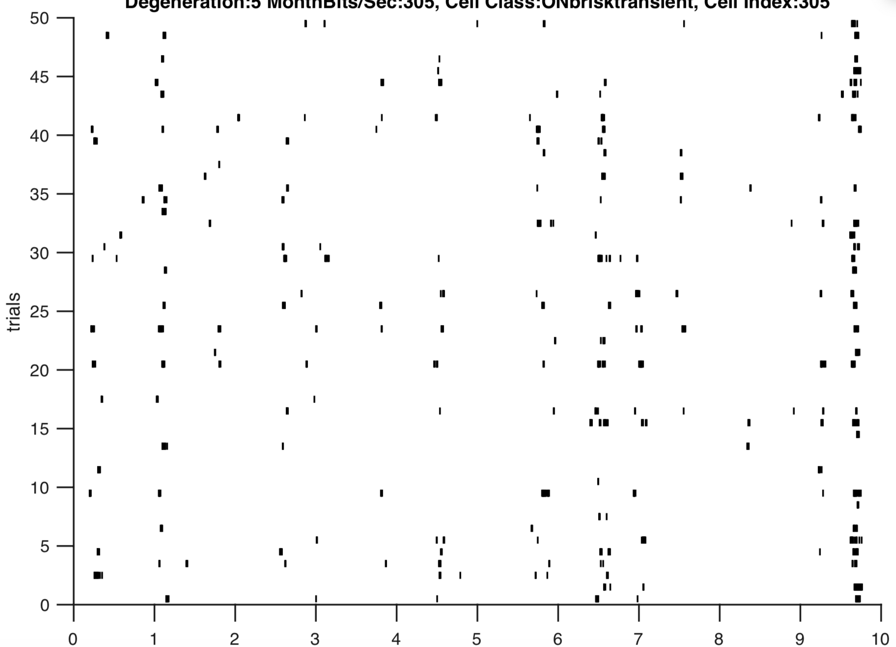
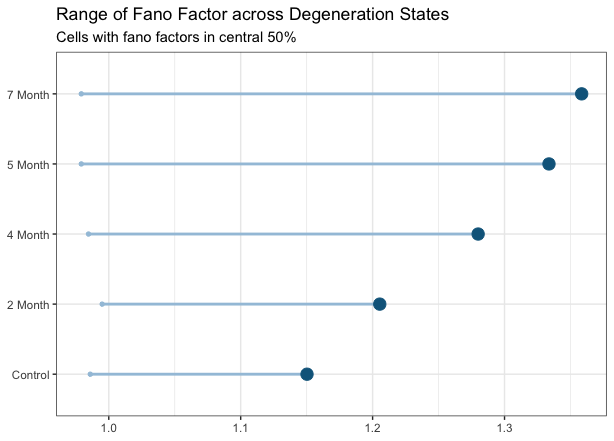

# Spike Distance Metrics

The encoding of visual stimuli by the retina is a complex process as it involves representing the spatio-temporal environment into a train of spikes for the brain. Features like the the outline of a baseball and the speed that ball travels after a toss have to be encoded quickly by the batter's retinas. In early studies, action potentials were thought to represent visual stimuli at a time-varying rate, which allowed models to effectively summarize some of the responses of the retina (Adrian 1928). For example, a poison distribution may model the occurrence of spikes pretty easily given this assumption. However, this model assumes that the mean spike count will be equal to the variance of the spike count, which may not agree with the reality of neural responses. In addition, certain retinal responses may not be captured by this time-varying rate interpretation as the retina can change its firing rate in a time frame that is too small to measure the temporal structure of neuronal signals. Studying spike trains using statistical modeling provides insights about retinal response patterns, but also makes mathematical assumptions that do not agree with the particular nature of spike train patterns (Field 2007).

{width=250px} {width=250px} 

Fig 2: A key observation that motivated this study was how the retina's responses have exhibited a loss in its structure across some degeneration steps. Thus evaluating whether this observation is consistent across metrics for spike train precision is going to be essential. 

### Fano Factor 

An approach that is not model-reliant in understanding the coding precision of neurons is with the fano factor, which describes the variability of spike quantity relative to the mean. By doing so, the reliability of the spike frequency across trials in a single recording. This measure across the degeneration states has shown that the variance in spike quantity is at a minimum about the same as the quantity of spikes in a spike train. As degeneration progresses however, the variability in the spiking frequency increases as the upper 75% quantile of a the state's fano-factors increases across degeneration (Fig 3).

{width=500px}

Fig 3: The upper tail of fano factor values across degeneration is greater across degeneration indicating greater variability in neural responses as degeneration progresses. 

This provides further evidence that an initial poison model may not be appropriate for modeling neuron spiking activity because most cells have variance in spike frequency that is greater than their mean spike frequency. If variance in spike quantities had been one, a poison generative process would still be flawed because it assumes that action potential times are independent of each other. In addition, a non-poison generative process could also have a fano factor around 1. Thus, the fano factor measure has provided some evidence of an increase in spike response variability with degeneraiton and also provides reason to study the retinal code that does not assume a model.  

Another potential metric being explored is the victor-purpura spike distance, which quantifies the similarity of two spike trains by finding the "cheapest" steps that converts one recording to the other. One assigns a cost to add and remove a single spike and a cost to shift a spike to make a replica of the reference spike train. This metric relates with fano factor through considering spike frequency but this metric allows for modifications of the costs (Victor and Purpura 1997).

